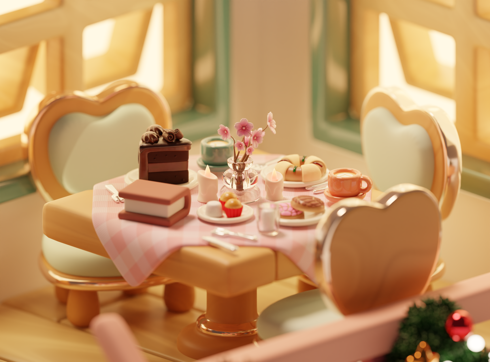

# A Christmas Bakery: From a Dream to 3D 🎄🍰

> I love baking, and once I had a dream of my perfect bakery shop. I decided to bring that vision to life in Blender, set during my favorite time of year: Christmas.

## My Vision ✨
This project is a personal creative milestone. It represents the intersection of my passion for baking and my technical skills in 3D environment design. The goal was to capture a cozy, festive atmosphere using stylized assets and warm lighting, including characteristic cake flavours and Mexican sweet bread.

## Technical Breakdown ✨
This environment was built from the ground up with a focus on clean topology and optimized assets, which eventually led to my successful admission into the **Augmented and Virtual Reality Design** program at **Hochschule Darmstadt**.

* The environment was created in **Blender** using a mix of high-poly and low-poly techniques.
* I utilized the **Affinity Suite** for creating custom textures.
* For texturing, I used a mix of PBR and textures workflow with a focus on stylized materials.
* This environment was design centering on cozy aesthetics and Christmas-themed lighting.

## Folder Structure 📁
- `/Renders`: High-quality final exports.
- `/Textures`: Custom-made textures made with Affinity used within the assets.
- `CakeShop.blend`: The core Blender project file.
---
*Created with love and a touch of Christmas magic by Sarahi.*
